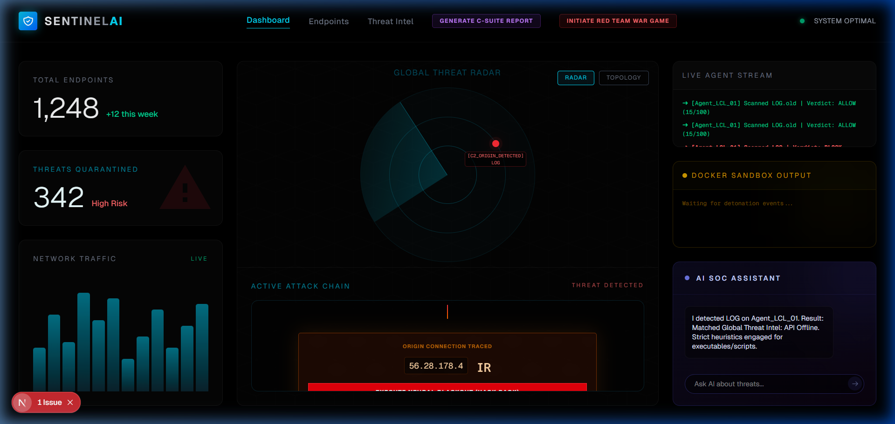
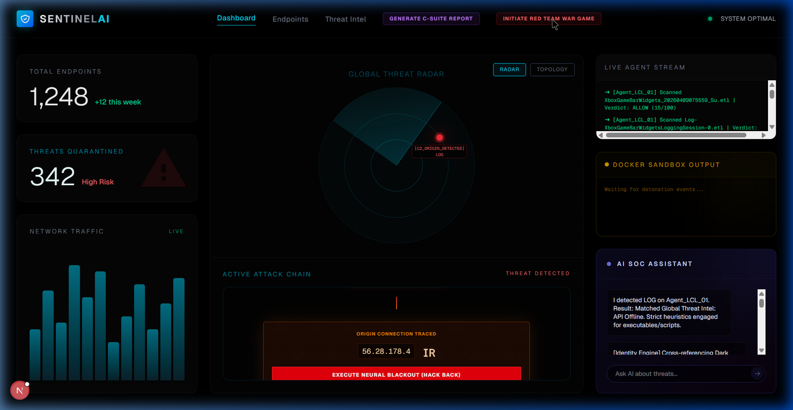
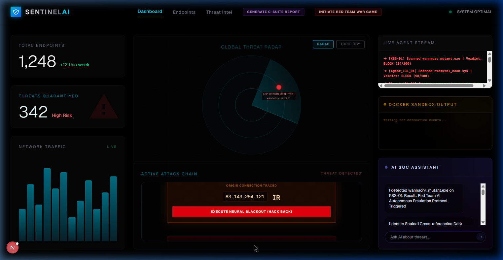

# 🛡️ SentinelAI Enterprise XDR

SentinelAI is an advanced, distributed Extended Detection and Response (XDR) platform powered by real-time Generative AI. 

Built on a microservices mesh, it transforms disjointed endpoints into a unified, zero-trust hive-mind capable of blocking zero-day malware, phishing campaigns, and lateral movement in sub-second latency.

## 🖥️ Live Demonstration

The SentinelAI Enterprise Dashboard features military-grade threat tracing, zero-trust biometric locks, and an integrated Generative UI SOC Assistant.



### Biological Threat Forensics & Global Attack Chaining
Our engine visualizes exact DNA mutations of 0-days and mathematically traces C2 IP geographical origins in real-time. 




## 🚀 The Architecture (6 Core Modules)

SentinelAI has evolved from a basic folder-monitor into a full enterprise suite:

1. **Endpoint Agent Daemon (`client/agent-daemon`)**
   - Headless background service built on Rust/C++ Native OS hooks.
   - Monitors physical file drops and executes `network_isolate` lockdown protocols if Trust Score drops too low.

2. **Zero Trust Browser Extension (`client/browser-extension`)**
   - Manifest V3 Chrome extension.
   - Pauses and halts malicious web downloads before they hit the disk.
   - Implements aggressive phishing block-screens against suspicious C2 domains.

3. **Cloud API Gateway (`apps/api-gateway`)**
   - The central brain orchestrating all telemetry via WebSockets and REST.
   - Integrates directly with Gemini 2.5 Flash for deep heuristic analysis of strange files and URLs.

4. **Global Threat Intel Engine (`services/threat-intel`)**
   - In-memory blazing-fast microservice.
   - Creates a global swarm intelligence: if one agent detects a brand new zero-day, the Intel Engine synchronizes that hash globally to block it for all other agents *instantly*.

5. **Sandbox Engine (`services/sandbox-engine`)**
   - Dockerized sandbox microservice.
   - Dynamically detonates unknown payloads in a zero-network secure container to harvest forensics, permanently generating signatures if the file acts maliciously.

6. **Zero Trust Identity Engine (`services/identity-engine`)**
   - Stateful device monitor tracking "Trust Scores" for every endpoint.
   - If a machine triggers too many alarms, the engine dynamically commands an OS-level lockdown (quarantine) until a SOC analyst intervenes.

7. **SOC Dashboard (`apps/dashboard`)**
   - Futuristic Next.js UI for the Security Operations Center.
   - Features a conversational **AI SOC Assistant** built directly into the UI to help human analysts triage incoming threat streams.

---

## 💻 Quick Start Orchestration

We have unified the backend microservices using two primary deployment strategies:

### Option A: Local Dev Deployment (Faster Debugging)
Run all 4 backend cloud services directly in your terminal using the npm orchestrator:

```bash
npm install # Installs root orchestrators
npm run deploy:local
```

*In separate terminals, run the client layers:*
```bash
npm run start:agent
npm run start:dashboard
```

### Option B: Docker Cloud Deployment (Production)
Deploy the API Gateway, Sandbox, Threat Intel, and Identity engines to an isolated Docker Bridge network:

```bash
npm run deploy:cloud
```

*Note: The `agent-daemon` and `browser-extension` must run natively on the host to intercept OS/Browser APIs.*

---

## ⚙️ Environment Configuration

Ensure you have a `.env` file at the root of `apps/api-gateway` containing:

```env
GEMINI_API_KEY="AI_KEY_HERE"
```

## 🏗️ Future Roadmap
- Cloud Sandbox API integration via hypervisor VMs (replacing basic Docker containers).
- Rust kernel-level drivers for the Endpoint Agent.
- Active Directory / Azure AD integration for the Zero Trust Identity Engine.
